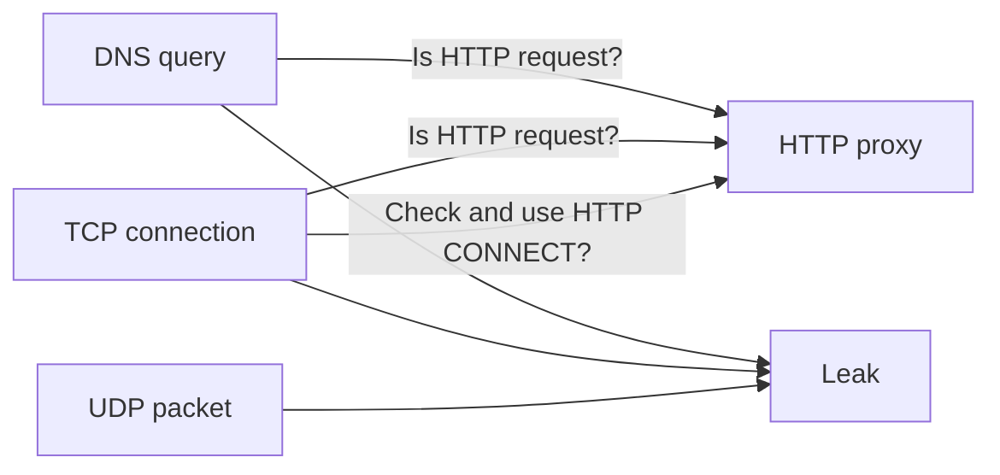
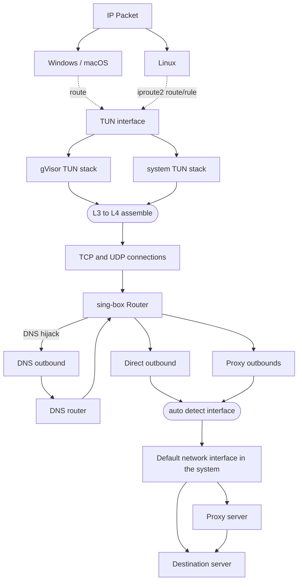

# Client

### :material-ray-start: 介绍

长期以来，图形操作系统上的代理客户端的现代用法和原理并没有被清晰地描述。
不过，我们可以将其大致分为三类：
`系统代理`、`防火墙重定向`，以及`虚拟接口`。

### :material-web-refresh: 系统代理

几乎所有图形环境都支持系统级代理，
本质上它们是普通的 HTTP 代理，只支持 TCP。


| 操作系统 / 桌面环境                     | 系统代理                       | 应用程序是否会遵循`系统代理`设置 |
| :-------------------------------------- | :----------------------------- | :------------------------------- |
| Windows                                 | :material-check:               | :material-check:                 |
| macOS                                   | :material-check:               | :material-check:                 |
| GNOME/KDE                               | :material-check:               | :material-check:                 |
| Android                                 | 需要 ROOT 或 adb（权限）       | :material-check:                 |
| Android/iOS（使用 sing-box 图形客户端） | 通过 `tun.platform.http_proxy` | :material-check:                 |

作为最广为人知的代理方式之一，它也存在许多缺点：
许多非基于 HTTP 的 TCP 客户端不会检查或使用系统代理。
此外，UDP 和 ICMP 流量会绕过代理。




<span style="color:red">
http https socks5 代理的具体协议不太了解，上图看不懂
</span>

### :material-wall-fire: 防火墙重定向

这种用法通常依赖操作系统提供的防火墙或 hook 接口，
例如 Windows 的 WFP、Linux 的 redirect、TProxy 和 eBPF，以及 macOS 的 pf。
虽然它具有侵入性且配置繁琐，
但由于对软件本身的技术要求较低，
它仍然在类似 V2Ray 的业余代理开源项目社区中很受欢迎。

### :material-expansion-card: 虚拟接口

所有 L2/L3 代理（严格定义上的 VPN，例如 OpenVPN、WireGuard）都是基于虚拟网络接口的，
这也是所有 L4 代理在 Android、iOS 等移动平台上作为 VPN 运行的唯一方式。

* _L2：数据链路层代理（最底层）_
* _L3：网络层代理（IP层）_
* _L4：传输层代理（TCP/UDP连接层）_


sing-box 继承并发展了 clash-premium 的 TUN inbound（L3 到 L4 转换），
作为执行透明代理的最合理方式。


<span style="color:red">
clash-premium 的 TUN inbound ？？？什么意思？ 
</span>



<span style="color:red">
上图看不懂？？？
</span>

## :material-cellphone-link: 示例

### 面向中国用户的基础 TUN 用法

=== ":material-numeric-4-box: IPv4 only"

    ```json
    {
      "dns": {
        "servers": [
          {
            "tag": "google",
            "type": "tls",
            "server": "8.8.8.8"
          },
          {
            "tag": "local",
            "type": "udp",
            "server": "223.5.5.5"
          }
        ],
        "strategy": "ipv4_only"
      },
      "inbounds": [
        {
          "type": "tun",
          "address": ["172.19.0.1/30"],
          "auto_route": true,
          // "auto_redirect": true, // On linux
          "strict_route": true
        }
      ],
      "outbounds": [
        // ...
        {
          "type": "direct",
          "tag": "direct"
        }
      ],
      "route": {
        "rules": [
          {
            "action": "sniff"
          },
          {
            "protocol": "dns",
            "action": "hijack-dns"
          },
          {
            "ip_is_private": true,
            "outbound": "direct"
          }
        ],
        "default_domain_resolver": "local",
        "auto_detect_interface": true
      }
    }
    ```

=== ":material-numeric-6-box: IPv4 & IPv6"

    ```json
    {
      "dns": {
        "servers": [
          {
            "tag": "google",
            "type": "tls",
            "server": "8.8.8.8"
          },
          {
            "tag": "local",
            "type": "udp",
            "server": "223.5.5.5"
          }
        ]
      },
      "inbounds": [
        {
          "type": "tun",
          "address": ["172.19.0.1/30", "fdfe:dcba:9876::1/126"],
          "auto_route": true,
          // "auto_redirect": true, // On linux
          "strict_route": true
        }
      ],
      "outbounds": [
        // ...
        {
          "type": "direct",
          "tag": "direct"
        }
      ],
      "route": {
        "rules": [
          {
            "action": "sniff"
          },
          {
            "protocol": "dns",
            "action": "hijack-dns"
          },
          {
            "ip_is_private": true,
            "outbound": "direct"
          }
        ],
        "default_domain_resolver": "local",
        "auto_detect_interface": true
      }
    }
    ```

=== ":material-domain-switch: FakeIP"

    ```json
    {
      "dns": {
        "servers": [
          {
            "tag": "google",
            "type": "tls",
            "server": "8.8.8.8"
          },
          {
            "tag": "local",
            "type": "udp",
            "server": "223.5.5.5"
          },
          {
            "tag": "remote",
            "type": "fakeip",
            "inet4_range": "198.18.0.0/15",
            "inet6_range": "fc00::/18"
          }
        ],
        "rules": [
          {
            "query_type": [
              "A",
              "AAAA"
            ],
            "server": "remote"
          }
        ],
        "independent_cache": true
      },
      "inbounds": [
        {
          "type": "tun",
          "address": ["172.19.0.1/30","fdfe:dcba:9876::1/126"],
          "auto_route": true,
          // "auto_redirect": true, // On linux
          "strict_route": true
        }
      ],
      "outbounds": [
        // ...
        {
          "type": "direct",
          "tag": "direct"
        }
      ],
      "route": {
        "rules": [
          {
            "action": "sniff"
          },
          {
            "protocol": "dns",
            "action": "hijack-dns"
          },
          {
            "ip_is_private": true,
            "outbound": "direct"
          }
        ],
        "default_domain_resolver": "local",
        "auto_detect_interface": true
      }
    }
    ```

### 面向中国用户的流量绕过用法

=== ":material-dns: DNS 规则"

    === ":material-shield-off: 存在 DNS 泄漏"

        ```json
        {
          "dns": {
            "servers": [
              {
                "tag": "google",
                "type": "tls",
                "server": "8.8.8.8"
              },
              {
                "tag": "local",
                "type": "https",
                "server": "223.5.5.5"
              }
            ],
            "rules": [
              {
                "rule_set": "geosite-geolocation-cn",
                "server": "local"
              },
              {
                "type": "logical",
                "mode": "and",
                "rules": [
                  {
                    "rule_set": "geosite-geolocation-!cn",
                    "invert": true
                  },
                  {
                    "rule_set": "geoip-cn"
                  }
                ],
                "server": "local"
              }
            ]
          },
          "route": {
            "default_domain_resolver": "local",
            "rule_set": [
              {
                "type": "remote",
                "tag": "geosite-geolocation-cn",
                "format": "binary",
                "url": "https://raw.githubusercontent.com/SagerNet/sing-geosite/rule-set/geosite-geolocation-cn.srs"
              },
              {
                "type": "remote",
                "tag": "geosite-geolocation-!cn",
                "format": "binary",
                "url": "https://raw.githubusercontent.com/SagerNet/sing-geosite/rule-set/geosite-geolocation-!cn.srs"
              },
              {
                "type": "remote",
                "tag": "geoip-cn",
                "format": "binary",
                "url": "https://raw.githubusercontent.com/SagerNet/sing-geoip/rule-set/geoip-cn.srs"
              }
            ]
          },
          "experimental": {
            "cache_file": {
              "enabled": true,
              "store_rdrc": true
            },
            "clash_api": {
              "default_mode": "Enhanced"
            }
          }
        }
        ```

    === ":material-security: 无 DNS 泄漏，但更慢"
    
        ```json
        {
          "dns": {
            "servers": [
              {
                "tag": "google",
                "type": "tls",
                "server": "8.8.8.8"
              },
              {
                "tag": "local",
                "type": "https",
                "server": "223.5.5.5"
              }
            ],
            "rules": [
              {
                "rule_set": "geosite-geolocation-cn",
                "server": "local"
              },
              {
                "type": "logical",
                "mode": "and",
                "rules": [
                  {
                    "rule_set": "geosite-geolocation-!cn",
                    "invert": true
                  },
                  {
                    "rule_set": "geoip-cn"
                  }
                ],
                "server": "google",
                "client_subnet": "114.114.114.114/24" // Any China client IP address
              }
            ]
          },
          "route": {
            "default_domain_resolver": "local",
            "rule_set": [
              {
                "type": "remote",
                "tag": "geosite-geolocation-cn",
                "format": "binary",
                "url": "https://raw.githubusercontent.com/SagerNet/sing-geosite/rule-set/geosite-geolocation-cn.srs"
              },
              {
                "type": "remote",
                "tag": "geosite-geolocation-!cn",
                "format": "binary",
                "url": "https://raw.githubusercontent.com/SagerNet/sing-geosite/rule-set/geosite-geolocation-!cn.srs"
              },
              {
                "type": "remote",
                "tag": "geoip-cn",
                "format": "binary",
                "url": "https://raw.githubusercontent.com/SagerNet/sing-geoip/rule-set/geoip-cn.srs"
              }
            ]
          },
          "experimental": {
            "cache_file": {
              "enabled": true,
              "store_rdrc": true
            },
            "clash_api": {
              "default_mode": "Enhanced"
            }
          }
        }
        ```

=== ":material-router-network: 路由规则"

    ```json
    {
      "outbounds": [
        {
          "type": "direct",
          "tag": "direct"
        }
      ],
      "route": {
        "rules": [
          {
            "action": "sniff"
          },
          {
            "type": "logical",
            "mode": "or",
            "rules": [
              {
                "protocol": "dns"
              },
              {
                "port": 53
              }
            ],
            "action": "hijack-dns"
          },
          {
            "ip_is_private": true,
            "outbound": "direct"
          },
          {
            "type": "logical",
            "mode": "or",
            "rules": [
              {
                "port": 853
              },
              {
                "network": "udp",
                "port": 443
              },
              {
                "protocol": "stun"
              }
            ],
            "action": "reject"
          },
          {
            "rule_set": "geosite-geolocation-cn",
            "outbound": "direct"
          },
          {
            "type": "logical",
            "mode": "and",
            "rules": [
              {
                "rule_set": "geoip-cn"
              },
              {
                "rule_set": "geosite-geolocation-!cn",
                "invert": true
              }
            ],
            "outbound": "direct"
          }
        ],
        "rule_set": [
          {
            "type": "remote",
            "tag": "geoip-cn",
            "format": "binary",
            "url": "https://raw.githubusercontent.com/SagerNet/sing-geoip/rule-set/geoip-cn.srs"
          },
          {
            "type": "remote",
            "tag": "geosite-geolocation-cn",
            "format": "binary",
            "url": "https://raw.githubusercontent.com/SagerNet/sing-geosite/rule-set/geosite-geolocation-cn.srs"
          }
        ]
      }
    }
    ```
